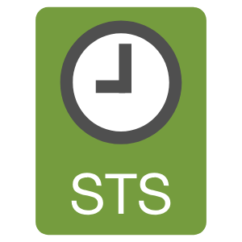

# Get STS Token from AWS



To use this script you must have initial configurations

## Requirements:

- IAM user
- IAM User Access Keys
- MFA Device ARN associated with IAM user
- Set values in AWS config and credentials files
- Set the MFA device arn value inside the script on line 58 as value of the MFA_SERIAL variable
- Set value of AWS region where the user will work inside the script on line 52 as value of the DEFAULT_REGION variable
<br/>
### First step
<br/>

Create AWS base profile for CLI using the IAM user credentials that will be used to obtain the STS token

**Example config file:**

```properties
isaac@vader~$ cat ~/.aws/config
[profile nubexpert]
region = us-east-1
output = json
```

**Example credentials file (Replace asterisks with the correct IAM user's access and secret key values):**

```properties
isaac@vader~$ cat ~/.aws/config
[nubexpert]
aws_access_key_id = ******************
aws_secret_access_key = ****************************
region = us-east-1
```

Now with the requirements we can execute the script, for this the script expects a couple of parameters, the first is the AWS profile that has just been previously configured, which will be used to authenticate with AWS and request the STS token , the second parameter is the name of the profile that we want to assign to the new generated credentials and that will be used later for the use of the resources (for this example we use "mfa"), as shown below:

```properties
isaac@vader~$ ./getTokenSTSAWS.sh nubexpert mfa
Token code for MFA Device (arn:aws:iam::123456789012:mfa/iam-user): 123456
INFO [2023-04-08 21:11:16]: ---------------------------------------------------------------------------------------
INFO [2023-04-08 21:11:16]: Generating new IAM STS Token ...
INFO [2023-04-08 21:11:16]: ---------------------------------------------------------------------------------------
INFO [2023-04-08 21:11:19]: ---------------------------------------------------------------------------------------
INFO [2023-04-08 21:11:19]: STS Session Token generated and updated in AWS credentials file successfully
INFO [2023-04-08 21:11:19]: ---------------------------------------------------------------------------------------
```

Now we can use our resources from the CLI using the profile generated from the script, as shown below

```properties
isaac@vader~$ aws s3 ls --profile mfa          
2017-07-20 19:03:36 bucket-1
2017-10-07 11:24:52 bucket-2
```

This token has a duration period of 12 hours by default, this can be modified if required with the following parameter given in seconds ***--duration-seconds***, this must go in the command found on the line 82 script.
